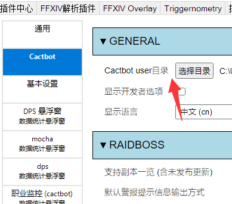

# 一个 Cactbot 触发器导入工具

[https://cactbot-importer.trim21.cn/](https://cactbot-importer.trim21.cn/)

Cactbot 没有内置的触发器导入工具，为了避免复制粘贴的痛苦，写了这么个工具。

先设置这个文件夹:



如果你用的是呆萌的整合，只要以`.js`为扩展名，可以任意命名，放在 `${Cactbot user目录}/raidboss/` 文件夹中。
比如`${Cactbot user目录}/raidboss/remote.js`。

由于咖啡的bug迟迟不修，下载的文件只能命名为 `raidboss.js`，并且放在`${Cactbot user目录}`文件夹里，即``${Cactbot user目录}/raidboss.js``。

## 可以被导入的文件:

### JavaScript 文件

以`.js`为后缀。

### TypeScript 文件

以`.ts`为后缀，会使用`esbuild`转译尝试把单个文件转译js。会擦除所有的类型信息，不能import任何函数或者值，仅能import类型。

一个例子: https://github.com/Trim21/cactbot-triggers/blob/master/src/name_to_job.ts

`import { EventMap, EventType } from '@type/event';`仅仅导入了类型，在转译的过程中会被删除。
如果在TypeScript代码中试图导入方法会失败，请考虑用webpack编译成js提供给别的用户。

### 合集

以 `.json` 为扩展名。

[Trim21/cactbot-triggers/用职业替换姓名.json](https://github.com/Trim21/cactbot-triggers/blob/master/用职业替换姓名.json)

```json
{
  "files": [
    "./src/name_to_job.ts"
  ]
}
```

仅包含 `files` 字段，每一个链接只能是相对json所在文件夹的相对路径，不能链接到其他的域名，也不能包含其他合集，仅能包含js或者ts文件。

比如 `https://cdn.jsdelivr.net/gh/Trim21/cactbot-triggers/用职业替换姓名.json` 中的 `"./src/name_to_job.ts"`
会被解析到 `https://cdn.jsdelivr.net/gh/Trim21/cactbot-triggers/src/name_to_job.ts`

如果你用的是github的仓库的话，因为`raw.githubusercontent.com` 被墙了，所以最好给用户jsdelivr的链接。
